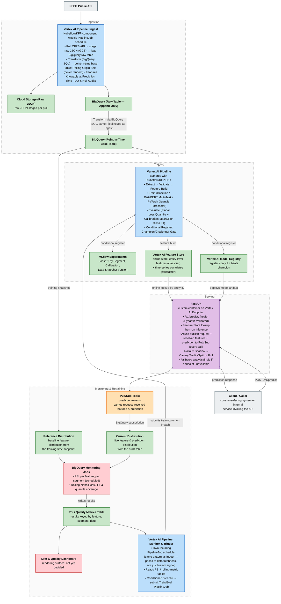

# CFPB Hierarchical Financial Text Classification & Forecasting

An end-to-end ML system that processes, classifies, and forecasts Consumer Financial Protection Bureau (CFPB) complaint data:

1. **Hierarchical Text Classifier (primary)** — predicts a complaint's `Product` (Level 1) and `Sub-product` (Level 2) from its free-text narrative. Core challenges: severe class imbalance, multi-task hierarchical label space, and temporal taxonomy drift.
2. **Weekly Complaint Volume Quantile Forecaster (secondary)** — forecasts weekly complaint volume per product category as a quantile forecast (p10/p50/p90) from the ingested pipeline data.

**Data source**: [CFPB Consumer Complaint Database](https://files.consumerfinance.gov/ccdb/complaints.csv.zip) (public, no API key). The live API supports weekly incremental ingestion; the bulk CSV is the fastest path for local experimentation.

See [CLAUDE.md](CLAUDE.md) for full project context, development guidelines, and current repo state.

---

## Target Architecture (GCP-centric)

Gray = external source · Blue = Vertex AI Pipelines · Green = data stores/artifacts · Orange = messaging · Purple = serving · Red = monitoring

### Component notes

- **Framing & RFC** — before building, write a short design doc: target definition, baseline, offline metric (pinball loss per quantile + calibration coverage for the forecaster; macro/per-class F1 for the classifier), online/business metric, latency & volume requirements, label source, and leakage risks. Circulate to Data Engineering, product, and backend before implementation starts.
- **Ingestion (`src/ingestion/`)** — the first component of the Vertex AI Pipeline (authored with the Kubeflow/KFP SDK), triggered by Vertex AI Pipelines' own recurring `PipelineJob` schedule (no standalone Cloud Run job). Pulls the previous 7 days of `date_received` records from the CFPB API, stages raw JSON in GCS (`gs://bucket/raw/YYYY/MM/DD/`), and loads it into an append-only BigQuery raw table for point-in-time reconstruction. Transformation (below) is chained on as this same pipeline's next stage.
- **Transformation (`src/transformation/`)** — BigQuery SQL builds a point-in-time-correct base table: only features knowable at prediction time. Rolling-origin backtest, **never a random split** — hard requirement to avoid temporal leakage. Plus DQ audits (row-count anomalies, narrative completeness, schema validation, missingness). Runs as the final stage of Ingest's own `PipelineJob`, immediately after the raw-table load — not a separate schedule or separate pipeline, so there's no window where new raw data has landed but the base table hasn't been rebuilt yet.
- **Models (`src/models/`, `src/forecasting/`)** — TF-IDF + Logistic Regression/Linear SVM baseline and `distilbert-base-uncased` (PyTorch, HF Transformers) with a joint multi-task head for the Product/Sub-product classifier; PyTorch for the weekly complaint-volume quantile forecaster (P10/P50/P90, pinball loss), with HuggingFace pretrained components used elsewhere where they help. Every run tracked in MLflow: loss/F1 by segment, calibration/coverage, and the data snapshot version. Forecaster output is translated into a downstream decision policy and simulated against history to quantify its impact before shipping.
- **Pipelines (`src/pipelines/`)** — authored with Kubeflow (KFP SDK), executed as Vertex AI Pipelines. Components, each its own container: `Extract (BigQuery) -> Validate -> Feature Build -> Train -> Evaluate -> Conditional Register`. Feature Build also batch-ingests the computed features into Vertex AI Feature Store's online store, so serving reads the same features training was built on. The register step is the champion/challenger gate — it writes to the Vertex AI Model Registry only if the challenger beats the current champion on the offline metric.
- **Evaluation (`src/evaluation/`)** — pinball loss per quantile + calibration coverage for the forecaster; per-class F1, confusion matrices, sliced metrics on rare/tail sub-products for the classifier (not just global accuracy/macro-F1). A coverage breach is the early-warning signal in production.
- **Feature Store** — Vertex AI Feature Store's online store, populated by the training pipeline's Feature Build step (the same computation that builds the BigQuery point-in-time base table), so training and serving read features from one shared computation path and never skew apart. Holds entity-level engineered features (consumer/company complaint history, rolling aggregate counts) for the classifier and time-series covariates (lag/rolling-volume features by product category) for the forecaster — the raw narrative itself still goes straight to DistilBERT, unstored.
- **Serving (`src/serving/`)** — FastAPI, containerized, deployed to a Vertex AI Endpoint (no Cloud Run). `GET /health`, `POST /v1/predict` (Pydantic-validated request/response, returns predicted hierarchy + confidence). On each request: an online Feature Store lookup by entity ID, then the model runs inference directly. Every request — including the resolved feature values from that Feature Store lookup, not just the raw input — plus the prediction is published asynchronously to a Pub/Sub topic (`prediction-events`), off the request's critical path, and delivered into the BigQuery audit table via a native Pub/Sub → BigQuery subscription (no Dataflow). The ML function owns correctness of what runs in the container; Data Engineering owns endpoint reliability.
- **Rollout** — shadow mode first (model scores live traffic, no decision uses it) → a small percentage of live decisions → full traffic, via canary/traffic-split on the Vertex AI Endpoint with rollback on breach. Fallback to the existing analytical rule if the endpoint is unavailable.
- **CI/CD (GitHub Actions, `.github/workflows/`)** — PR: `ruff`/`black`, `mypy`, `pytest`, feature-transform tests, a training smoke test on sampled data. Merge to main: build & push the container image to Artifact Registry, run the full pipeline in staging, run the evaluation gate, deploy to a staging Vertex AI Endpoint, integration tests. Promotion: manual approval, then canary/traffic-split on the endpoint with rollback on breach. Model artifact is versioned separately from code.
- **Monitoring & Retraining (`src/monitoring/`)** — the ML function owns model quality, Data Engineering owns operational health. Drift: BigQuery scheduled queries compute PSI per input feature/segment and category-mix drift by comparing two explicit tables — the **Reference Distribution** (the training-time feature snapshot the current champion was trained on, sourced from the point-in-time base table) against the **Current Distribution** (live feature and prediction values from the Pub/Sub-fed audit table) — which is what makes per-feature PSI possible at all rather than just prediction/output-level drift. This detection job can run more frequently than retraining (e.g. daily) purely for early visibility, since it's cheap and commits no training compute. Both the drift and quality jobs write their computed results — PSI/category-mix values, rolling pinball loss/F1, quantile coverage — into a separate **PSI / Quality Metrics Table**, keyed by feature/segment/date, distinct from the Reference/Current Distribution tables they read from; without that separate table there'd be no time series to threshold against, just a single ephemeral query result each run. Quality: a scheduled BigQuery job joins past predictions to realized outcomes, tracking rolling pinball loss/F1 and quantile coverage. A dedicated **Monitor & Trigger pipeline** — itself a Vertex AI Pipeline on its own recurring `PipelineJob` schedule, deliberately the same pattern as Ingestion rather than faster — reads that metrics table and, on a breach, submits a new run of the training pipeline via the Vertex AI Pipelines SDK. That pacing is intentional, not incidental: submitting a retrain before new data has landed would just refit the existing training snapshot, produce essentially the same model, and can't beat the champion at the Conditional Register gate — wasted compute for no possible upside, so the trigger check is paced to data freshness, not just to the breach signal. This is in addition to, not instead of, the existing CI-triggered (on merge to `main`) and manual/ad hoc trigger paths — all three converge on the same pipeline and evaluation gate, so a bad retrain never auto-promotes regardless of what triggered it. Dashboard rendering surface isn't decided yet.
